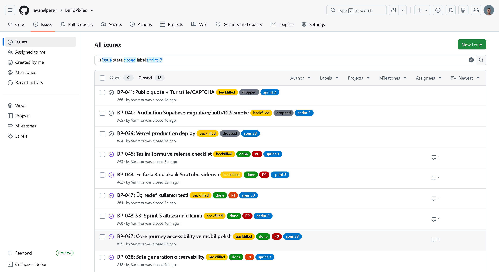
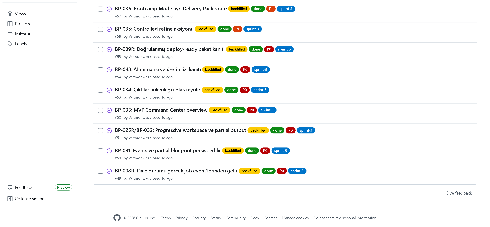

# Sprint 3 — Board Durumu

> **Kaynak:** `gh issue list --repo avanalperen/BuildPixies --state all`
> **Board:** GitHub Issues (README'de Product Backlog URL olarak belirtilen)

## Bulgu ve düzeltme (1 Ağustos 2026)

Sprint 3 sırasında board'da **hiç `sprint-3` etiketli issue açılmamıştı**; işler
yalnızca `docs/sprint-3.md` üzerinden takip edilmişti. Sprint 1'de 10, Sprint
2'de 9 issue varken Sprint 3 boştu.

Bu boşluk, planın kendi kuralı uygulanarak kapatıldı:

> "Tarihsel sprint kayıtları geriye dönük 'daha iyi görünmesi' için
> değiştirilmez; eksik kanıt sonradan eklenirse `backfilled` olarak açıkça
> etiketlenir." — `docs/plan.md` §1.2

18 story, **gerçek durumlarıyla** ve `backfilled` etiketiyle issue'ya
dönüştürüldü. Her issue gövdesinde geriye dönük açıldığı yazılıdır. Sprint 2'de
de aynı yaklaşım kullanılmıştı (`../../sprint-2/board/2026-07-19-board-closeout-backfilled.png`).

## Board sayımı (backfill sonrası)

| Ölçüm | Sprint 1 | Sprint 2 | Sprint 3 |
| --- | ---: | ---: | ---: |
| Issue | 10 | 9 | 18 |
| Kapalı | 10 | 9 | 18 |
| Açık | 0 | 0 | 0 |

## Sprint 3 board görünümü

### Done (15) — kapalı

| # | Story |
| --- | --- |
| #49 | BP-008R Pixie durumu gerçek job event'lerinden gelir |
| #50 | BP-031 Events ve partial blueprint persist edilir |
| #51 | BP-025R/BP-032 Progressive workspace ve partial output |
| #52 | BP-033 MVP Command Center overview |
| #53 | BP-034 Çıktılar anlamlı gruplara ayrılır |
| #54 | BP-048 AI mimarisi ve üretim izi kanıtı |
| #55 | BP-039R Doğrulanmış deploy-ready paket kanıtı |
| #56 | BP-035 Controlled refine aksiyonu |
| #57 | BP-036 Bootcamp Mode ayrı Delivery Pack route |
| #58 | BP-038 Safe generation observability |
| #59 | BP-037 Accessibility/mobil polish |
| #60 | BP-043-S3 Altı zorunlu kanıt |
| #61 | BP-047 Üç kullanıcı testi |
| #62 | BP-044 YouTube videosu |
| #63 | BP-045 Teslim formu |

### Dropped (3) — kapalı, gerekçeli

| # | Story | Gerekçe |
| --- | --- | --- |
| #64 | BP-039 Vercel production deploy | ADR-012 |
| #65 | BP-040 Production Supabase RLS smoke | ADR-012 |
| #66 | BP-041 Public quota + CAPTCHA | ADR-014 |

## Board görselleri için

Board görselleri alınmış ve klasöre eklenmiştir:

